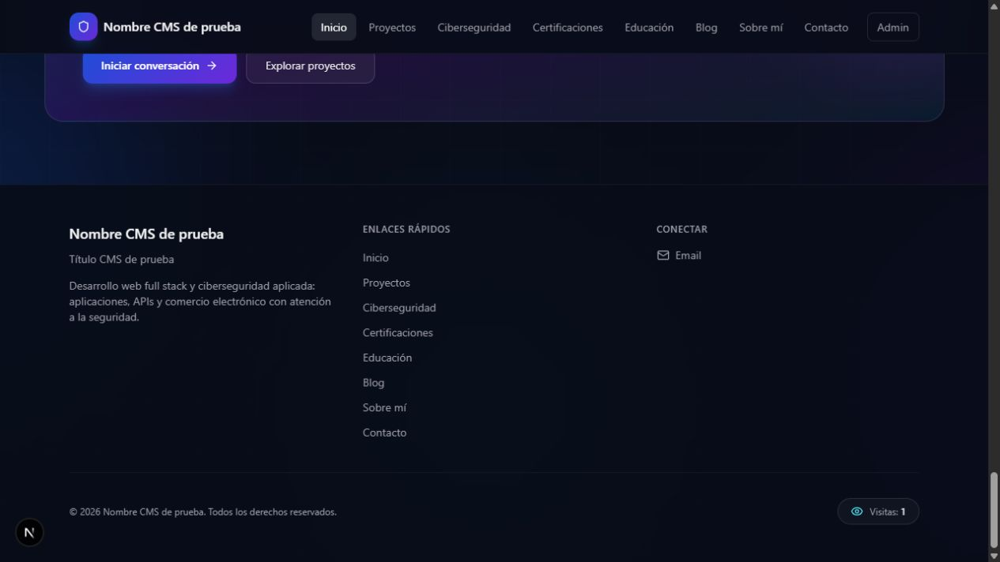
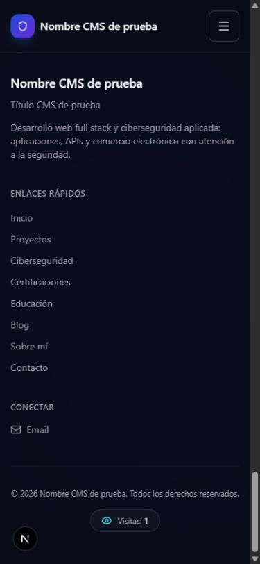

# Contador de visitas y refuerzo SEO

Implementación local: 29-09-2026. Añadido después de Sprint 5 y antes del despliegue. No se ha publicado ni se han registrado visitas en la base de producción.

## Contador del footer

- Muestra el total de sesiones de visita registradas desde su activación. No recupera visitas históricas ni pretende medir personas únicas.
- Un identificador aleatorio en `sessionStorage` identifica la sesión de pestaña. Recargar o navegar conserva ese identificador; abrir otra sesión puede sumar una visita. Duplicar/restaurar pestañas puede conservar el identificador según el navegador.
- MongoDB guarda un documento por sesión en `visits`, con un hash SHA-256 del identificador como `_id` y fecha de creación. La clave primaria evita duplicados incluso entre procesos; no depende de un contador en memoria. No se guardan IP, URL visitada, correo, huella del dispositivo ni user-agent en esta colección. Los logs HTTP generales del servidor siguen sujetos a su configuración existente.
- `GET /api/visits` solo lee. `POST /api/visits` acepta únicamente `{ sessionId: UUIDv4 }`, exige el origen del frontend y admite hasta 30 solicitudes por IP/hora, además del límite global. Se ignoran user-agents de bots comunes. Esto no impide que un cliente malicioso simule nuevas sesiones; es una cifra aproximada, no una herramienta de analítica antifraude.
- El navegador omite cookies de autenticación en ambas operaciones. Si no puede usar almacenamiento, solo consulta el total. Si el servicio falla, se muestra **no disponible**, nunca un número simulado. El panel no monta el footer y no registra visitas por sí mismo.
- Las respuestas no se cachean. El número se consulta al montar el componente, sin sondeo continuo. Reiniciar el backend conserva el total porque los registros están en MongoDB. Incluir la colección en las copias; borrarla reduce o reinicia el total.
- No requiere una cuenta de analítica, una API key adicional ni cambios de variables. Publicar backend y frontend juntos; comprobar que el usuario de MongoDB pueda crear/escribir/leer la colección. Antes de desplegar, las pruebas usan un almacén en memoria, no la base real.
- El recuento exacto recorre la colección con `countDocuments`; para el volumen inicial de un portafolio evita mantener dos cifras que puedan divergir. Si crece mucho, revisar tiempos y almacenamiento antes de adoptar agregados persistentes con actualización transaccional. El límite por IP del middleware está en memoria por proceso.

## Estado del SEO

La base técnica está preparada y el contenido se orientó mejor a desarrollo full stack y ciberseguridad. No hay una medición de posicionamiento ni una puntuación SEO externa en esta entrega.

| Elemento | Estado en el código listo para desplegar |
| --- | --- |
| Título principal | `Armando Mora \| Desarrollo Full Stack y Ciberseguridad` como valor predeterminado |
| Descripción principal | Describe desarrollo full stack, desarrollo web, APIs, e-commerce y seguridad de aplicaciones |
| Texto visible | Footer y especialidades incluyen desarrollo web full stack y ciberseguridad aplicada; perfil predeterminado describe React, Node.js y MongoDB |
| Proyectos | Título y h1 describen proyectos de desarrollo full stack; descripción concreta de tecnologías y seguridad |
| Ciberseguridad | Título incluye AppSec y descripción centrada en seguridad web y laboratorios autorizados |
| CMS | Los títulos, descripciones y perfil personalizados conservan prioridad; el panel orienta sobre cómo redactarlos |
| HTML inicial | Contenido público renderizado en servidor; los textos importantes no dependen de esperar una petición del navegador |
| Canonical | Usa el dominio HTTPS del entorno de producción, aunque el CMS conserve una referencia anterior |
| Datos estructurados | Person con áreas de conocimiento; WebSite vinculado a la persona e idioma español; se mantienen artículos y breadcrumbs |
| Compartir enlaces | Open Graph, Twitter e imagen social de respaldo; locale español de Colombia |
| Rastreo | Robots permite las páginas públicas y excluye admin; panel con noindex y protección de caché |
| Sitemap | Incluye rutas públicas y todos los detalles publicados, con fechas de actualización cuando existen |
| Search Console | Token HTML opcional mediante `GOOGLE_SITE_VERIFICATION`; falta verificar la propiedad real |

Los términos principales se colocaron en títulos y contenido legible, sin repetir listas artificiales en el footer. Google no usa la etiqueta `meta keywords` para posicionar y no garantiza indexación ni primeras posiciones; el contenido útil y los títulos descriptivos sí ayudan a comprender las páginas. [Guía oficial de Google](https://developers.google.com/search/docs/fundamentals/seo-starter-guide).

## Después del despliegue

1. Comprobar que el HTML servido tenga el título nuevo y canonical `https://armandomora.com.co/`. En la revisión previa, el sitio todavía servía la versión anterior con canonical `.dev`; se corrige publicando el build nuevo con las URLs correctas.
2. Configurar redirecciones permanentes de HTTP y `www` al dominio HTTPS preferido, preservando ruta y parámetros. Es una tarea del alojamiento, todavía pendiente.
3. Abrir [Google Search Console](https://search.google.com/search-console). Verificar la propiedad de dominio mediante el TXT que Google indique, o una propiedad de prefijo `https://armandomora.com.co/` mediante la etiqueta HTML. Para la segunda opción, poner **solo el valor content del token** en `GOOGLE_SITE_VERIFICATION` del frontend antes de compilar; reconstruir, reiniciar y mantenerlo mientras se use ese método. No se ha creado ni verificado una propiedad desde este trabajo.
4. Enviar `https://armandomora.com.co/sitemap.xml` en Sitemaps. Inspeccionar la portada, proyectos y ciberseguridad, y solicitar indexación cuando Google permita hacerlo. Enviar un sitemap facilita descubrir URLs, pero no asegura indexación. [Documentación de sitemaps](https://developers.google.com/search/docs/crawling-indexing/sitemaps/build-sitemap).
5. Completar y publicar el caso real de Tejiendo Raíces: problema, participación, arquitectura MERN, integración Wompi, capturas y enlace. Añadir artículos y laboratorios con resultados propios aporta más información que dejar catálogos vacíos. No se publicaron ni inventaron casos en esta entrega.
6. Revisar en Search Console las consultas, impresiones, clics e indexación. Empezar por búsquedas de marca y específicas: “Armando Mora desarrollador full stack”, “Armando Mora ciberseguridad” y tecnologías/problemas de proyectos documentados. Estos son objetivos editoriales, no consultas con volumen o posiciones medidos.

El contador del footer no aumenta el posicionamiento ni permite saber qué consultas trajeron usuarios. Para eso se necesita Search Console; son funciones distintas.

## Validación

- Backend: 54 pruebas de seguridad/operación, más 2 smoke y 7 de uploads, correctas. Cinco pruebas nuevas cubren deduplicación, conteo de sesiones diferentes, origen, entrada inválida, bots, límites, carreras de clave y caída de almacenamiento.
- Frontend: 32 pruebas de seguridad/contenido en total, incluyendo sesión persistida, montajes simultáneos, almacenamiento bloqueado, fallos de API y SEO. La prueba adicional de SEO se ejecutó después de la suite de 31; ambas pasaron.
- Build, TypeScript y lint correctos. Fixtures comprueban el título principal, texto visible, contador en HTML y datos estructurados, además de los recorridos previos de SSR, sitemap y RSS.
- Release local: ocho páginas, canonical, chunks, robots, sitemap, RSS y protección administrativa correctos. Portada: 196,7 KiB de JS gzip calculado, frente a 195,9 KiB del Sprint 5; CSS 10,9 KiB. Todas las rutas mantienen el presupuesto de 210/14 KiB.
- Navegador con API local en memoria: total 1 al entrar, 1 tras recarga y 1 tras navegar a proyectos. Footer correcto a 390 px; ancho del documento de 375 px por la barra vertical, sin desbordamiento horizontal. No se utilizó MongoDB real para estas pruebas.

