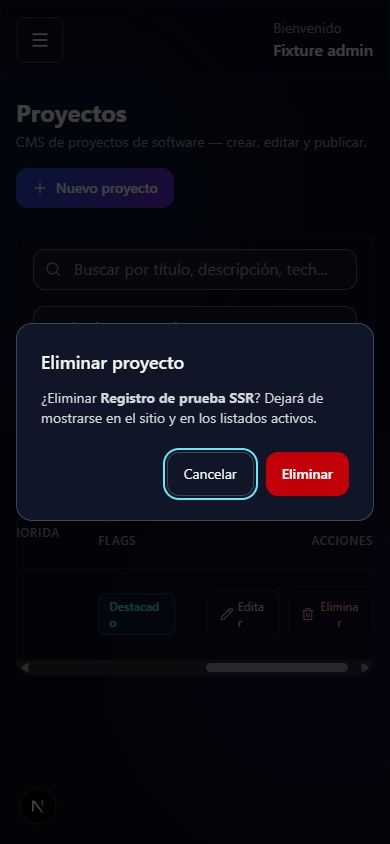

# Sprint 4 — Accesibilidad y diseño adaptable

Fecha: 29-09-2026. Implementado y validado localmente, sin despliegue ni cambios en datos de producción.

## Resultado

- Navegación pública y panel con enlace **Saltar al contenido**, destino enfocable y foco visible. La sección activa usa `aria-current`. La navegación pública pasa a menú desplegable antes de que los enlaces de escritorio queden demasiado juntos; admite Escape y devolución de foco al botón.
- El menú lateral del panel queda oculto también para el teclado cuando está cerrado en móvil. Se abre como diálogo nativo con título accesible, foco inicial, recorrido circular con Tab/Mayús+Tab, Escape, bloqueo del contenido de fondo y restauración del foco. Al pasar a escritorio se cierra el menú móvil.
- Los cinco diálogos de borrado usan un componente compartido. Cancelar recibe el foco inicial. Durante el envío se conserva el foco en el diálogo y se bloquea el cierre; los errores se anuncian dentro del diálogo. Se retiraron los avisos falsos de borrado irreversible: los cinco controladores realizan borrado lógico.
- Formularios de proyectos, laboratorios, certificaciones, educación, blog y ajustes con resumen de errores navegable, `aria-invalid` y descripción del error asociada al campo. Ajustes de perfil, branding y SEO con etiquetas vinculadas; redes y disponibilidad con nombres accesibles. Login asocia sus errores al correo y la contraseña. Se anuncia la validación de sesión.
- Los títulos principales del panel identifican la página actual; la marca lateral ya no ocupa el h1. Se corrigieron los niveles de los apartados de ajustes.
- Texto secundario más legible, botones de acento más oscuros para sostener texto blanco, bordes de campos visibles y foco también en selectores y regiones desplazables. Controles de al menos 44 px de altura y campos de 16 px en móvil. Soporte CSS de colores forzados para los degradados.
- Se eliminó el movimiento decorativo continuo del fondo. Las secciones principales ya no parten de opacidad cero en el HTML inicial. MotionConfig respeta la preferencia de movimiento reducido y CSS reduce animaciones/transiciones.
- El contenido del panel puede contraerse mediante `min-width: 0`; las cinco tablas mantienen sus columnas dentro de regiones desplazables con nombre y acceso por teclado. Código y tablas Markdown también tienen desplazamiento local. Textos largos pueden partirse; imágenes Markdown respetan el ancho disponible.
- Contacto indica los campos obligatorios y omite el icono de ubicación si no hay ubicación configurada.
- Los fixtures usan ahora **`.next-fixture`**, fuera de `.next`, con exclusiones de Git y ESLint y rutas de tipos actualizadas. Se corrigió una colisión detectada al ejecutar pruebas y build a la vez: la limpieza del build podía borrar archivos del servidor de pruebas. La repetición final de ambos pasó con las carpetas separadas.

## Evidencia

| Comprobación | Resultado |
| --- | --- |
| TypeScript / build | Compilación de producción correcta, incluyendo validación de tipos |
| ESLint | 0 errores, 0 advertencias; [reporte](sprint-4-lint.json) |
| `test:security` frontend | 28/28; incluye cuatro pruebas nuevas de errores anidados, asociación ARIA, etiquetas y contraste de colores definidos |
| `test:public` | HTML inicial, 404/500, filtros, paginación, casos de estudio, perfil CMS, imagen social, sitemap de 67 URL y RSS 200/503 correctos |
| Build servido con `next start` | Ocho páginas, canonical, chunks, cabeceras, robots, sitemap, RSS y protección de caché/indexación administrativa comprobados |
| Menú del panel a 390 px | Foco inicial en Cerrar; Mayús+Tab pasa al último control; Tab regresa al primero; Escape vuelve a Abrir menú |
| Confirmación a 390 px | Foco inicial en Cancelar; recorrido circular; fallo HTTP simulado visible dentro del diálogo y foco de regreso en Cancelar |
| Ajustes a 390 px | Email inválido bloquea envío; resumen lleva a `profile.email`, con `aria-invalid=true` y descripción asociada |
| Navegación pública a 320 px | Saltar al contenido enfoca `main-content`; Escape cierra el menú y enfoca Abrir menú |

Anchos medidos en el DOM del navegador, en píxeles CSS:

| Vista | Viewport | Ancho del documento |
| --- | ---: | ---: |
| Portada | 320 / 768 / 1280 | 305 / 753 / 1265 |
| Catálogo de proyectos | 320 / 768 / 1280 | 305 / 753 / 1265 |
| Panel de proyectos | 320 / 768 / 1280 | 320 / 768 / 1280 |
| Contacto | 320 | 305 |
| Ajustes | 390 | 375 |

La diferencia de 15 px corresponde a la barra vertical del navegador. No hubo desbordamiento horizontal del documento en esas vistas. La tabla del panel mantuvo 800 px en móvil/tableta y desplazamiento dentro del contenedor.

Muestras de contraste calculadas: texto secundario `#a1a1aa` sobre base `#080c18`: **7,61:1**; sobre superficie `#1d2233`: **6,17:1**; texto blanco sobre los extremos azul/púrpura del botón: **6,70:1 / 7,10:1**; borde `#667085` sobre la superficie: **3,18:1**. La prueba muestrea también los puntos intermedios del degradado; no representa una medición exhaustiva de todas las combinaciones de contenido.

## Alcance y pendientes

La validación y el fallo de borrado usados en el navegador fueron fixtures en memoria. No se enviaron correos ni se borraron registros reales. Los servidores de pruebas y producción local se detuvieron al terminar. Se mantuvo el servidor de desarrollo que ya tenía el usuario.

Esta revisión verifica los recorridos y tamaños descritos. No equivale a una certificación WCAG ni a una prueba completa con NVDA/VoiceOver, Safari/iOS, zoom de texto del sistema o dispositivos físicos. La preferencia de movimiento reducido y colores forzados se implementó, pero no se forzó desde el sistema operativo durante esta ejecución. El contenido e imágenes que se carguen después requieren revisar sus descripciones, longitud y legibilidad.

Próximo sprint: rendimiento y preparación operativa para producción. Siguen pendientes el despliegue y la activación/entrega real de Resend documentada en [contact-resend.md](contact-resend.md).

Referencias: [patrón de diálogo modal WAI-ARIA](https://www.w3.org/WAI/ARIA/apg/patterns/dialog-modal/), [contraste mínimo](https://www.w3.org/WAI/WCAG22/Understanding/contrast-minimum.html), [reflow](https://www.w3.org/WAI/WCAG22/Understanding/reflow.html). Se consultó también la documentación de accesibilidad de Next incluida en la versión instalada.
